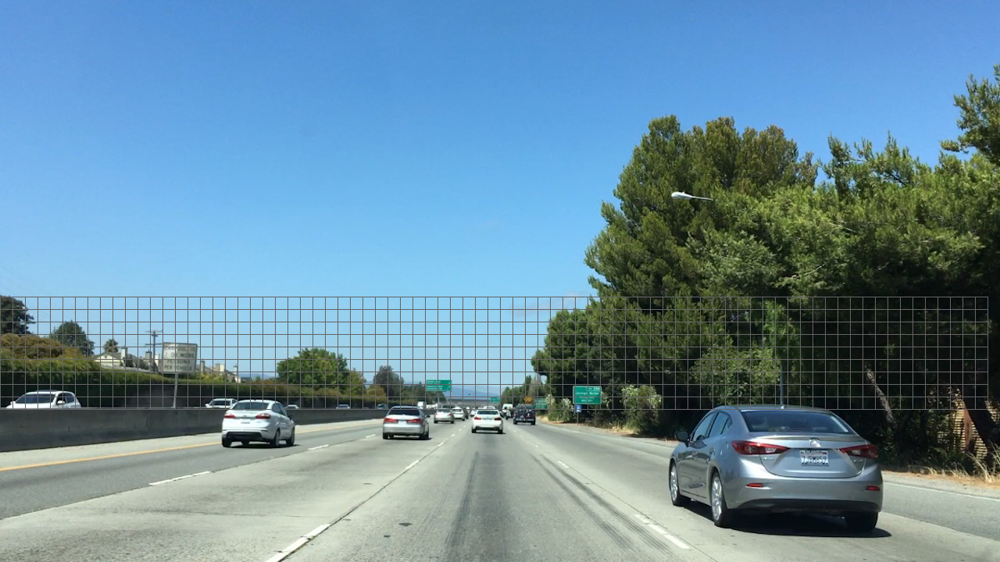

# CarND-Vehicle-Detection

**Vehicle Detection Project**

The goals / steps of this project are the following:

* Perform a Histogram of Oriented Gradients (HOG) feature extraction on a labeled training set of images and train a classifier Linear SVM classifier
* Optionally, you can also apply a color transform and append binned color features, as well as histograms of color, to your HOG feature vector. 
* Note: for those first two steps don't forget to normalize your features and randomize a selection for training and testing.
* Implement a sliding-window technique and use your trained classifier to search for vehicles in images.
* Run your pipeline on a video stream (start with the test_video.mp4 and later implement on full project_video.mp4) and create a heat map of recurring detections frame by frame to reject outliers and follow detected vehicles.
* Estimate a bounding box for vehicles detected.


[youtube link video](https://youtu.be/hraAwMG7U_g)

[private camera video](https://youtu.be/cVLcPlI6bpM)

## [Rubric](https://review.udacity.com/#!/rubrics/513/view) Points
###Here I will consider the rubric points individually and describe how I addressed each point in my implementation.  

---
### Histogram of Oriented Gradients (HOG)

I started by reading in all the `vehicle` and `non-vehicle` images.  Here is an example of one of each of the `vehicle` and `non-vehicle` classes:

Vehicle images:

   |   |   |  

Non - vehicle images:

   |  

I then explored different color spaces and different `skimage.hog()` parameters (`orientations`, `pixels_per_cell`, and `cells_per_block`).  I grabbed random images from each of the two classes and displayed them to get a feel for what the `skimage.hog()` output looks like.

Vehicles

Original | Bin patial | Hist patial 
:------:|:------:|:-------:
   |   |   
   |   |  
   |   |  

Non-vehicles

Original | Bin patial | Hist patial 
:------:|:------:|:-------:
   |   |   

Here is an example using the `YCrCb` color space and HOG parameters of `orientations=8`, `pixels_per_cell=(8, 8)` and `cells_per_block=(2, 2)`:

Vehicles

Original | HOG 
:------:|:------:
   |   
   |    
   |   


Non-vehicles

Original | Hog
:------:|:------:
   |   

#### 2. Explain how you settled on your final choice of HOG parameters.

I tried various combinations of parameters and use following:

```
  color_space = 'YCrCb' # Can be RGB, HSV, LUV, HLS, YUV, YCrCb
  orient = 9  # HOG orientations
  pix_per_cell = 8 # HOG pixels per cell
  cell_per_block = 2 # HOG cells per block
  hog_channel = "ALL" # Can be 0, 1, 2, or "ALL"
  spatial_size = (32, 32) # Spatial binning dimensions
  hist_bins = 32    # Number of histogram bins
  spatial_feat = True # Spatial features on or off
  hist_feat = True # Histogram features on or off
  hog_feat = True # HOG features on or off
  y_start_stop = [500, 670] # Min and max in y to search in slide_window()
```

#### 3. Describe how (and identify where in your code) you trained a classifier using your selected HOG features (and color features if you used them).

I trained a linear SVM using template images provided by this project.

### Sliding Window Search

#### 1. Describe how (and identify where in your code) you implemented a sliding window search.  How did you decide what scales to search and how much to overlap windows?

```
        self.y_start_stop = (380,550)
        scale = 1
        out_img1, box_list1 = self.find_cars(img, scale)
        
        self.y_start_stop = (400,600)
        scale = 1.5
        out_img2, box_list2 = self.find_cars(img, scale)
        
        self.y_start_stop = (400,670)
        scale = 2.0
        out_img3, box_list3 = self.find_cars(img, scale)
```

#### 2. Show some examples of test images to demonstrate how your pipeline is working.  What did you do to optimize the performance of your classifier?


Ultimately I searched on two scales using YCrCb 3-channel HOG features plus spatially binned color and histograms of color in the feature vector, which provided a nice result.  Here are some example images:

Original
 

Scale 1
 

Scale 1.5
 

Scale 2
 

### Image with false positive windows:

 

### Here is a frame and its corresponding heatmaps:

 

Result image:

 

* gray squeres: box from one frame
* blue: final box from multiple frames

### Video Implementation

#### 1. Provide a link to your final video output.  Your pipeline should perform reasonably well on the entire project video (somewhat wobbly or unstable bounding boxes are ok as long as you are identifying the vehicles most of the time with minimal false positives.)
Here's a [link to my video result](./out_project_video.mp4) or [youtube link](https://youtu.be/hraAwMG7U_g)


#### 2. Describe how (and identify where in your code) you implemented some kind of filter for false positives and some method for combining overlapping bounding boxes.

I recorded the positions of positive detections in each frame of the video.  From the positive detections I created a heatmap and then thresholded that map to identify vehicle positions.  I then used `scipy.ndimage.measurements.label()` to identify individual blobs in the heatmap.  I then assumed each blob corresponded to a vehicle.  I constructed bounding boxes to cover the area of each blob detected.  

```
def set_box_list(self, box_list):
        heat = np.zeros_like(self.image[:,:,0]).astype(np.float)
        for box in box_list:
            # Add += 1 for all pixels inside each bbox
            # Assuming each "box" takes the form ((x1, y1), (x2, y2))
            heat[box[0][1]:box[1][1], box[0][0]:box[1][0]] += 1
        
        self.heatmap_orig = np.clip(heat, 0, 255)

        heat[heat <= self.threshold] = 0        
        self.heatmap_treshold = np.clip(heat, 0, 255)
```


## Discussion

 What could you do to make it more robust?
 
 * I have learned a great deal about color spectrums, image gradients and support vector classifiers. Even though this method of image recognition is slow (processing speed) but it was a great learning tool for me due to its customizability.
 * I would prefere more robust classifier based on neural networks. The SVM classifier is OK but I would prefer more precise accuracy.
 * Tracking pipeline may be more robust then implemented


